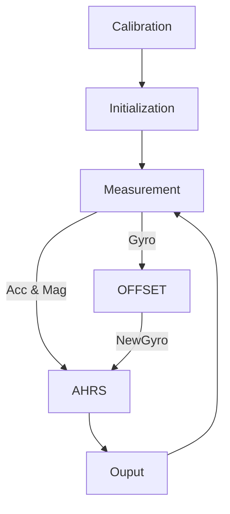

[Magdwick](https://github.com/xioTechnologies/Fusion) 是一种常用的 IMU 传感器数据融合算法，其利用「加速度计」与「磁力计」作为反馈来修正「陀螺仪」，使得「IMU」解算出更准确的姿态。

## 第一步：认识 IMU

IMU 全称 "Inertial Measurement Unit"，即「惯性测量单元」。通常由「陀螺仪」与「加速度计」组成，称为「六轴 IMU」。常用的部分 “IMU" 附带「磁力计」与「气压计」，分别构成「九轴 IMU」与「十轴 IMU」。

NOTE：本文坐标系均为：**右手系（X-Y-Z）**

### 加速度计（Accelerometer）

加速度计可测量 "X-Y-Z" 三轴的加速度大小，单位：$m/s^2$

需要注意的是，"IMU" 水平静止时，其测量值为：

$$
\vec{a} = \left[
\begin{matrix}
    a_x \\
    a_y \\
    a_z
\end{matrix}
\right] = \left[
\begin{matrix}
  0 \\
  0 \\
  g
\end{matrix}
\right]
$$

即：与「重力加速度」**大小相等**、**方向相反**的向量

这样的测量结果源于加速度计的测量原理，这里不做深入探讨，可以简化为「弹簧秤」来理解，其静止时「弹簧秤」由于重力被压缩，测量值即为重力的「正值」。同时可以推断，当 "IMU" 做「自由落体」运动时，加速度计的测量值为：$[0, 0, 0]^T$

### 陀螺仪（Gyro）

陀螺仪可测量 "X-Y-Z" 三轴旋转的角速度大小，单位：$rad/s$

旋转方向可用「右手定则」判断，当 "IMU" 水平时，yaw 轴旋转方向为：

- 逆时针——正
- 顺时针——负

陀螺仪有多种测量原理，常用的 "MEMS" 陀螺仪的测量原理与加速度计类似，但其测量值容易收到温度影响而产生「温飘」

### 磁力计（Magnetometer）

磁力计可测量地磁场强度，本文磁场方向均为：**东（X）-北（Y）-天（Z）**，单位：$\mu T$

地磁场的产生与分布可参考[「Wiki-地磁场」](https://zh.wikipedia.org/wiki/地磁场)

这里给出中国华南、华东地区的参考范围：

- 磁场强度：$[45 \mu T, 50 \mu T]$
- 磁倾角：$[30^\circ, 50^\circ]$
- 磁偏角：$[-2^\circ, -6^\circ]$

可以看到，磁场强度 $\vec{m}$ 的方向大致为「指向北极、偏向地面」，可以根据此特点来判断磁力计自身三个轴的方向，确保与 "IMU" 坐标系相同

## 第二步：为什么要「数据融合（Sensor Fusion）」

使用 IMU 的目的通常是为了获取机体的姿态，即：Pitch（$\theta$）、Roll（$\phi$）、Yaw（$\psi$）

不同传感器对于姿态的测量贡献是不一样的，为了实现更稳定、更准确的测量结果，传感器数据融合成为了非常强力的手段

### 陀螺仪（Gyro）测量姿态

根据其测量原理，若其测量为：

$$
\vec{\omega} = \left[
  \begin{matrix}
    \omega_x \\
    \omega_y \\
    \omega_z
  \end{matrix}
\right]
$$

则可以通过积分获得姿态：

$$
\theta = \int \omega_x dt \\
\phi = \int \omega_y dt \\
\psi = \int \omega_z dt
$$

由于积分的存在，计算得到的姿态相对比较「低频」，没有「高频」抖动，可以认为陀螺仪是一个低频传感器

但陀螺仪的测量并不是「真实值」，并且有加性噪声，即

$$
\vec{\omega} = \vec{\omega_0} + \vec{\gamma}
$$

其中，噪声 $\vec{\gamma}$ 对温度敏感，积分后导致姿态产生随时间变化的**偏移**

### 加速度计（Accelerometer）测量姿态

当机体 Pitch（$\theta$）、Roll（$\phi$） 不为 0 时，重力 $\vec{g}$ 会在 X-Y 平面产生分量：

$$
a_x = -g \sin(\phi) \cos(\theta) \\
a_y = g \sin(\theta) \\
a_z = g \cos(\phi) \cos(\theta)
$$

通过测量值可以很容易逆求出：

$$
\theta = \arcsin(\frac{a_y}{g}) \\
\phi = \arccos(\frac{a_z}{g \cos(\theta)})
$$

由于重力加速度恒定，所以解算的姿态并不会「发散」

缺点有两点：

- 无法解算 Yaw
- 加速度计的测量值通常附带「高频」噪声

### 磁力计（Magnetometer）测量姿态

磁力计测量姿态的原理和加速度计相似，但因为磁倾角的存在，地磁场在水平面存在分量，因此**理论上**可以解算出三个姿态角

但是，磁力计非常容易收到外界磁场（强磁与弱磁）的干扰，只适合在开阔无持续干扰的环境中使用，因此非常多场景中，IMU 不使用磁力计解算所有姿态角，而仅作为 Yaw 的反馈测量

### 融合算法

通过上述讲解，IMU 数据融合的思路便非常清晰了，即：

- Gyro 积分获得姿态
- Accelerometer 修正 Pitch 与 Roll
- Magnetometer 修正 Yaw（可选）

目前广泛应用的算法有：

- 基于互补滤波的 Mahony
- 基于反馈补偿的 Magdwick
- 基于最优估计的 Kalman Filter

本文以 Magdwick 为例讲解 「IMU 数据融合」

## Magdwick Algorithm

为了方便计算，该算法中的角度（旋转）计算均使用「[四元数（Quaternion）](https://krasjet.github.io/quaternion/quaternion.pdf)」进行，本文不涉及该知识讲解，主要侧重算法的步骤与理解

该算法主要分为以下几个步骤：

1. 设置 Gyro、Accelerometer、Magnetometer 的标定参数（如果测量精度要求不高，可选）
2. 初始化 AHRS 对象（负责姿态解算）与 OFFSET对象（用于估计 Gyro 零偏，可选）
3. 获取 IMU 测量数据（确保每个坐标系对齐，这很重要）
4. 利用测量数据更新 OFFSET 并剔除 Gyro 零偏
5. 将步骤（4）中的数据传入 AHRS 对象进行「加速度计反馈」「磁力计反馈」「陀螺仪积分」
6. 输出解算后的姿态角，并返回步骤（3）

大致流程图如下：



### Calibration

```c
#include "../../Fusion/Fusion.h"

...

int main() {

    // Define calibration (replace with actual calibration data if available)
    const FusionMatrix gyroscopeMisalignment = {1.0f, 0.0f, 0.0f, 0.0f, 1.0f, 0.0f, 0.0f, 0.0f, 1.0f};
    const FusionVector gyroscopeSensitivity = {1.0f, 1.0f, 1.0f};
    const FusionVector gyroscopeOffset = {0.0f, 0.0f, 0.0f};
    const FusionMatrix accelerometerMisalignment = {1.0f, 0.0f, 0.0f, 0.0f, 1.0f, 0.0f, 0.0f, 0.0f, 1.0f};
    const FusionVector accelerometerSensitivity = {1.0f, 1.0f, 1.0f};
    const FusionVector accelerometerOffset = {0.0f, 0.0f, 0.0f};
    const FusionMatrix softIronMatrix = {1.0f, 0.0f, 0.0f, 0.0f, 1.0f, 0.0f, 0.0f, 0.0f, 1.0f};
    const FusionVector hardIronOffset = {0.0f, 0.0f, 0.0f};

    ...

    // This loop should repeat each time new gyroscope data is available
    while (true) {

        ...

        // Apply calibration
        gyroscope = FusionCalibrationInertial(gyroscope, gyroscopeMisalignment, gyroscopeSensitivity, gyroscopeOffset);
        accelerometer = FusionCalibrationInertial(accelerometer, accelerometerMisalignment, accelerometerSensitivity, accelerometerOffset);
        magnetometer = FusionCalibrationMagnetic(magnetometer, softIronMatrix, hardIronOffset);

        ...

    }
}
```

本文不涉及标定参数的测量，但给出如下标定计算公式：

#### Inertial calibration

The `FusionCalibrationInertial` function applies gyroscope and accelerometer calibration parameters using the calibration model:

$$
i_c = Ms(i_u - b)
$$

- $i_c$ is the calibrated inertial measurement and `return` value
- $i_u$ is the uncalibrated inertial measurement and `uncalibrated` argument
- M is the misalignment matrix and `misalignment` argument
- s is the sensitivity diagonal matrix and `sensitivity` argument
- b is the offset vector and `offset` argument

#### Magnetic calibration

The `FusionCalibrationMagnetic` function applies magnetometer calibration parameters using the calibration model:

$$
m_c = S(m_u - h)
$$

- $m_c$ is the calibrated magnetometer measurement and `return` value
- $m_u$ is the uncalibrated magnetometer measurement and `uncalibrated` argument
- S is the soft iron matrix and `softIronMatrix` argument
- h is the hard iron offset vector and `hardIronOffset` argument

### Initialization

```c
#include "../../Fusion/Fusion.h"

...

#define SAMPLE_RATE (100) // replace this with actual sample rate

int main() {

    ...

    // Initialise algorithms
    FusionOffset offset;
    FusionAhrs ahrs;

    FusionOffsetInitialise(&offset, SAMPLE_RATE);
    FusionAhrsInitialise(&ahrs);

    // Set AHRS algorithm settings
    const FusionAhrsSettings settings = {
            .convention = FusionConventionEnu,
            .gain = 0.5f,
            .gyroscopeRange = 2000.0f, /* replace this with actual gyroscope range in degrees/s */
            .accelerationRejection = 10.0f,
            .magneticRejection = 10.0f,
            .recoveryTriggerPeriod = 5 * SAMPLE_RATE, /* 5 seconds */
    };
    FusionAhrsSetSettings(&ahrs, &settings);

    // This loop should repeat each time new gyroscope data is available
    while (true) {

        ...

    }
}
```

这部分的关键有两个：

- OFFSET 的频率 `SAMPLE_RATE` 和测量频率保持一致
- `FusionAhrsSettings` 的参数：
  - `convention` 选择 `Enu`（东-北-天）
  - `gain` 为补偿增益，当 `gain = 0` 时，补偿不参与，姿态仅有 Gyro 积分获得
  - `gyroscopeRange` 需要参考实际 Gyro
  - `accelerationRejection` 与  `magneticRejection` 为补偿阈值（单位：度），当误差超过这个范围时不进行反馈补偿
  - `recoveryTriggerPeriod` 补偿失效后的恢复时间

### Measuremet

```c
#include "../../Fusion/Fusion.h"

...

int main() {

    ...

    // This loop should repeat each time new gyroscope data is available
    while (true) {

        // Acquire latest sensor data
        FusionVector gyroscope = {0.0f, 0.0f, 0.0f}; // replace this with actual gyroscope data in degrees/s
        FusionVector accelerometer = {0.0f, 0.0f, 1.0f}; // replace this with actual accelerometer data in g
        FusionVector magnetometer = {1.0f, 0.0f, 0.0f}; // replace this with actual magnetometer data in arbitrary units

        ...

    }
}
```

每次循环开始都获取 IMU 测量值，单位：

- Gyro：degrees/s
- Accelerometer：g
- Magnetometer：Any（Recommend $\mu T$）

### OFFSET

```c
#include "../../Fusion/Fusion.h"

...

int main() {

    ...

    // This loop should repeat each time new gyroscope data is available
    while (true) {

        ...

        // Update gyroscope offset correction algorithm
        gyroscope = FusionOffsetUpdate(&offset, gyroscope);

        ...

    }
}
```

```c
/**
 * @file FusionOffset.c
 * @author Seb Madgwick
 * @brief Gyroscope offset correction algorithm for run-time calibration of the
 * gyroscope offset.
 */

//------------------------------------------------------------------------------
// Includes

#include "FusionOffset.h"
#include <math.h> // fabs

//------------------------------------------------------------------------------
// Definitions

/**
 * @brief Cutoff frequency in Hz.
 */
#define CUTOFF_FREQUENCY (0.02f)

/**
 * @brief Timeout in seconds.
 */
#define TIMEOUT (5)

/**
 * @brief Threshold in degrees per second.
 */
#define THRESHOLD (3.0f)

//------------------------------------------------------------------------------
// Functions

/**
 * @brief Initialises the gyroscope offset algorithm.
 * @param offset Gyroscope offset algorithm structure.
 * @param sampleRate Sample rate in Hz.
 */
void FusionOffsetInitialise(FusionOffset *const offset, const unsigned int sampleRate) {
    offset->filterCoefficient = 2.0f * (float) M_PI * CUTOFF_FREQUENCY * (1.0f / (float) sampleRate);
    offset->timeout = TIMEOUT * sampleRate;
    offset->timer = 0;
    offset->gyroscopeOffset = FUSION_VECTOR_ZERO;
}

/**
 * @brief Updates the gyroscope offset algorithm and returns the corrected
 * gyroscope measurement.
 * @param offset Gyroscope offset algorithm structure.
 * @param gyroscope Gyroscope measurement in degrees per second.
 * @return Corrected gyroscope measurement in degrees per second.
 */
FusionVector FusionOffsetUpdate(FusionOffset *const offset, FusionVector gyroscope) {

    // Subtract offset from gyroscope measurement
    gyroscope = FusionVectorSubtract(gyroscope, offset->gyroscopeOffset);

    // Reset timer if gyroscope not stationary
    if ((fabs(gyroscope.axis.x) > THRESHOLD) || (fabs(gyroscope.axis.y) > THRESHOLD) || (fabs(gyroscope.axis.z) > THRESHOLD)) {
        offset->timer = 0;
        return gyroscope;
    }

    // Increment timer while gyroscope stationary
    if (offset->timer < offset->timeout) {
        offset->timer++;
        return gyroscope;
    }

    // Adjust offset if timer has elapsed
    offset->gyroscopeOffset = FusionVectorAdd(offset->gyroscopeOffset, FusionVectorMultiplyScalar(gyroscope, offset->filterCoefficient));
    return gyroscope;
}

//------------------------------------------------------------------------------
// End of file
```

OFFSET 本质上是一个低通滤波器，用于估计 Gyro 在静止时的零偏，注意点如下：

- 仅仅在静止状态工作
- 静止的判断条件由「阈值」与「TimeOut」判断
- 可调节截止频率 `CUTOFF_FREQUENCY` 来改变低通滤波器的频率特性（建议默认）

### AHRS

```c
#include "../../Fusion/Fusion.h"

...

int main() {

    ...

    // This loop should repeat each time new gyroscope data is available
    while (true) {

        ...

        // Update gyroscope AHRS algorithm
        FusionAhrsUpdate(&ahrs, gyroscope, accelerometer, magnetometer, deltaTime);

	...

    }
}
```

参数中 `deltaTime` 为每次循环的时间

其内部实现如下：

```c
/**
 * @brief Updates the AHRS algorithm using the gyroscope, accelerometer, and
 * magnetometer measurements.
 * @param ahrs AHRS algorithm structure.
 * @param gyroscope Gyroscope measurement in degrees per second.
 * @param accelerometer Accelerometer measurement in g.
 * @param magnetometer Magnetometer measurement in arbitrary units.
 * @param deltaTime Delta time in seconds.
 */
void FusionAhrsUpdate(FusionAhrs *const ahrs, const FusionVector gyroscope, const FusionVector accelerometer, const FusionVector magnetometer, const float deltaTime) {
#define Q ahrs->quaternion.element

    // Store accelerometer
    ahrs->accelerometer = accelerometer;

    // Reinitialise if gyroscope range exceeded
    if ((fabs(gyroscope.axis.x) > ahrs->settings.gyroscopeRange) || (fabs(gyroscope.axis.y) > ahrs->settings.gyroscopeRange) || (fabs(gyroscope.axis.z) > ahrs->settings.gyroscopeRange)) {
        const FusionQuaternion quaternion = ahrs->quaternion;
        FusionAhrsReset(ahrs);
        ahrs->quaternion = quaternion;
        ahrs->angularRateRecovery = true;
    }

    // Ramp down gain during initialisation
    if (ahrs->initialising == true) {
        ahrs->rampedGain -= ahrs->rampedGainStep * deltaTime;
        if ((ahrs->rampedGain < ahrs->settings.gain) || (ahrs->settings.gain == 0.0f)) {
            ahrs->rampedGain = ahrs->settings.gain;
            ahrs->initialising = false;
            ahrs->angularRateRecovery = false;
        }
    }

    // Calculate direction of gravity indicated by algorithm
    const FusionVector halfGravity = HalfGravity(ahrs);

    // Calculate accelerometer feedback
    FusionVector halfAccelerometerFeedback = FUSION_VECTOR_ZERO;
    ahrs->accelerometerIgnored = true;
    if (FusionVectorIsZero(accelerometer) == false) {

        // Calculate accelerometer feedback scaled by 0.5
        ahrs->halfAccelerometerFeedback = Feedback(FusionVectorNormalise(accelerometer), halfGravity);

        // Don't ignore accelerometer if acceleration error below threshold
        if ((ahrs->initialising == true) || ((FusionVectorMagnitudeSquared(ahrs->halfAccelerometerFeedback) <= ahrs->settings.accelerationRejection))) {
            ahrs->accelerometerIgnored = false;
            ahrs->accelerationRecoveryTrigger -= 9;
        } else {
            ahrs->accelerationRecoveryTrigger += 1;
        }

        // Don't ignore accelerometer during acceleration recovery
        if (ahrs->accelerationRecoveryTrigger > ahrs->accelerationRecoveryTimeout) {
            ahrs->accelerationRecoveryTimeout = 0;
            ahrs->accelerometerIgnored = false;
        } else {
            ahrs->accelerationRecoveryTimeout = ahrs->settings.recoveryTriggerPeriod;
        }
        ahrs->accelerationRecoveryTrigger = Clamp(ahrs->accelerationRecoveryTrigger, 0, ahrs->settings.recoveryTriggerPeriod);

        // Apply accelerometer feedback
        if (ahrs->accelerometerIgnored == false) {
            halfAccelerometerFeedback = ahrs->halfAccelerometerFeedback;
        }
    }

    // Calculate magnetometer feedback
    FusionVector halfMagnetometerFeedback = FUSION_VECTOR_ZERO;
    ahrs->magnetometerIgnored = true;
    if (FusionVectorIsZero(magnetometer) == false) {

        // Calculate direction of magnetic field indicated by algorithm
        const FusionVector halfMagnetic = HalfMagnetic(ahrs);

        // Calculate magnetometer feedback scaled by 0.5
        ahrs->halfMagnetometerFeedback = Feedback(FusionVectorNormalise(FusionVectorCrossProduct(halfGravity, magnetometer)), halfMagnetic);

        // Don't ignore magnetometer if magnetic error below threshold
        if ((ahrs->initialising == true) || ((FusionVectorMagnitudeSquared(ahrs->halfMagnetometerFeedback) <= ahrs->settings.magneticRejection))) {
            ahrs->magnetometerIgnored = false;
            ahrs->magneticRecoveryTrigger -= 9;
        } else {
            ahrs->magneticRecoveryTrigger += 1;
        }

        // Don't ignore magnetometer during magnetic recovery
        if (ahrs->magneticRecoveryTrigger > ahrs->magneticRecoveryTimeout) {
            ahrs->magneticRecoveryTimeout = 0;
            ahrs->magnetometerIgnored = false;
        } else {
            ahrs->magneticRecoveryTimeout = ahrs->settings.recoveryTriggerPeriod;
        }
        ahrs->magneticRecoveryTrigger = Clamp(ahrs->magneticRecoveryTrigger, 0, ahrs->settings.recoveryTriggerPeriod);

        // Apply magnetometer feedback
        if (ahrs->magnetometerIgnored == false) {
            halfMagnetometerFeedback = ahrs->halfMagnetometerFeedback;
        }
    }

    // Convert gyroscope to radians per second scaled by 0.5
    const FusionVector halfGyroscope = FusionVectorMultiplyScalar(gyroscope, FusionDegreesToRadians(0.5f));

    // Apply feedback to gyroscope
    const FusionVector adjustedHalfGyroscope = FusionVectorAdd(halfGyroscope, FusionVectorMultiplyScalar(FusionVectorAdd(halfAccelerometerFeedback, halfMagnetometerFeedback), ahrs->rampedGain));

    // Integrate rate of change of quaternion
    ahrs->quaternion = FusionQuaternionAdd(ahrs->quaternion, FusionQuaternionMultiplyVector(ahrs->quaternion, FusionVectorMultiplyScalar(adjustedHalfGyroscope, deltaTime)));

    // Normalise quaternion
    ahrs->quaternion = FusionQuaternionNormalise(ahrs->quaternion);
#undef Q
}
```

#### 加速度计反馈

步骤如下：

1. 根据当前姿态「推断（计算）」此刻重力加速度的方向，或者说计算重力加速度在 X-Y-Z 三个轴上的「推断投影」，记为

   $$
   \vec{g}_{c}
   $$
2. 加速度的测量值为

   $$
   \vec{g}_{m}
   $$
3. 它们之间的差异可以用如下公式来衡量（以下描述并不准确，具体计算有区别）

   $$
   \frac{\vec{g}_{m} \times \vec{g}_{c}}{|\vec{g}_{m}| * |\vec{g}_{c}|} = \sin(\Delta \theta) \approx \Delta \theta \\
   \text{for small $\Delta \theta$}
   $$
4. 则角速度误差为

   $$
   \frac{\Delta \theta }{\Delta T}
   $$
5. 将此误差反馈到 Gyro 的测量值

#### 磁力计反馈

磁力计反馈与加速度计反馈相似，但只反馈 Z 轴角速度误差

步骤如下：

1. 根据当前姿态「推断（计算）」此刻重力加速度的方向，或者说计算重力加速度在 X-Y-Z 三个轴上的「推断投影」，记为

   $$
   \vec{g}_{c}
   $$
2. 磁力计测量值为

   $$
   \vec{M}_m
   $$
3. 测量的正北方向为

   $$
   \vec{W}_m = \vec{g}_{c} \times \vec{M}_m \\
   \vec{N}_m = \vec{W}_m \times \vec{g}_{c}
   $$
4. 根据当前姿态「推断（计算）」此刻正北的方向，即 Z 的旋转，记为

   $$
   \vec{N}_c
   $$
5. 同理计算误差

   $$
   \frac{\vec{N}_{m} \times \vec{N}_{c}}{|\vec{N}_{m}| * |\vec{N}_{c}|} = \sin(\Delta \theta) \approx \Delta \theta \\
   \text{for small $\Delta \theta$}
   $$
6. 则角速度误差为

   $$
   \frac{\Delta \theta }{\Delta T}
   $$
7. 将此误差反馈到 Gyro 的测量值

#### 姿态计算

由反馈补偿后的 Gyro 测量值积分获得姿态

### Output

```c
#include "../../Fusion/Fusion.h"

...

int main() {

    ...

    // This loop should repeat each time new gyroscope data is available
    while (true) {

        ...

        // Print algorithm outputs
        const FusionEuler euler = FusionQuaternionToEuler(FusionAhrsGetQuaternion(&ahrs));
        const FusionVector earth = FusionAhrsGetEarthAcceleration(&ahrs);

        printf("Roll %0.1f, Pitch %0.1f, Yaw %0.1f, X %0.1f, Y %0.1f, Z %0.1f\n",
               euler.angle.roll, euler.angle.pitch, euler.angle.yaw,
               earth.axis.x, earth.axis.y, earth.axis.z);
    }
}
```

输出四远数转换后的欧拉角即可

### Example

例程示范：[Fusion/Example](https://github.com/xioTechnologies/Fusion/tree/main/Examples)

## 总结

Magdwicks 算法使用了「反馈」的思想来实现「数据融合」，思路巧妙，值得深入学习

同时，IMU 作为当今机器人控制「必不可少」的传感器之一，掌握「IMIU」的原理与使用非常重要
